# JAVA高级编程与应用大作业

## 影院管理

# 1. 系统主要的类图

   列出主要类图，每个类都有哪些字段，每个字段的属性。如下所示：

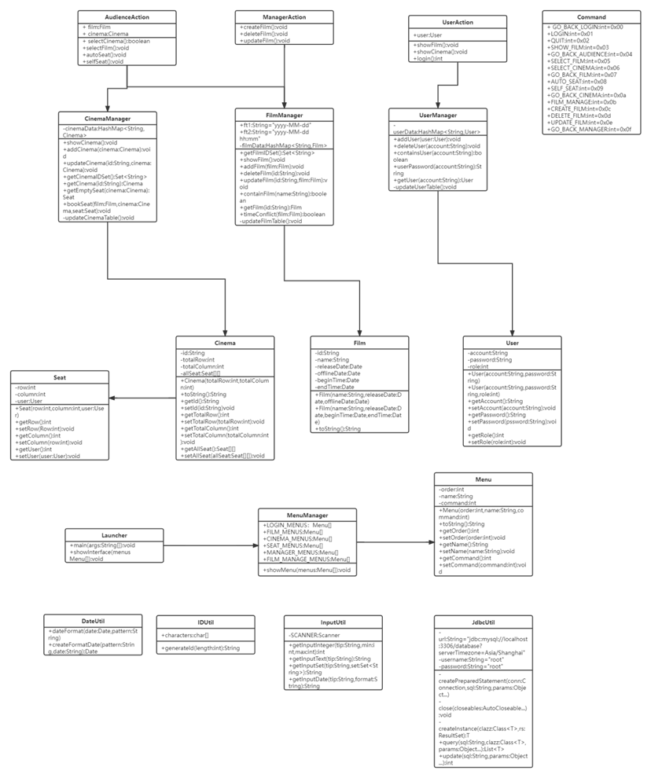

每个类的功能：

 

Launcher：程序入口，递归展示菜单界面

MenuManager：菜单管理拥有静态菜单，和静态展示给定菜单方法

Menu：实体，菜单拥有序号，名称和菜单命令

Command：命令说明书，命令所对应的序号

UserAction：登录、展示影片、展示影厅

AudienceAction：选择影片、选择影厅、自动选座、手动选择

ManagerAction：增加影片、删除影片、更新影片

CinemaManager：影厅数据、展示影院、增加影院、修改影院、影厅ID集合、获取 cinema实例 、返回 cinema的一个空座、订座

FilmManager：日期格式、影片数据、获取影片ID集合、展示所有电影、添加电影、删除电影、修改电影、查询名称为 name的电影是否存在、返回 film实例和判断影片是否时间冲突

UserManager: 用户数据、添加用户、删除用户、查询账号为 account的用户是否存在、返回 account的密码、返回账号为 account的用户 User

Cinema：影厅拥有编号，排数，列数，座位列表。其中编号唯一，排数和列数确定座位列表的大小，座位列表主要用于展示和计算余票，方便观众选购座位。

Film：影片拥有编号，名称，上映时间，下架时间，播放时间和结束时间。其中编号唯一

Seat：座位拥有排号、列号和所属用户。排号和列号决定座位所处位置，所属用户用来判定座位是否被订购。

User：用户分为管理员和观众。用户拥有账号，密码和角色。其中账号唯一，账号和密码用于登录，角色用来区分管理员和观众。

DateUtil：格式化日期、根据格式化日期创建 Date对象

IDUtil：生成指定长度的ID

InputUtil：系统输入包括从控制台获取一个给定范围区间内的整数、从控制台获取一个字符串、从控制台获取一个在 set里的字符串和从控制台获取一个给定日期格式的日期

JdbcUtil：数据库链接，初始化，增删改查等等

# 2. 系统数据库设计

| 表名             | 功能说明     |
| ---------------- | ------------ |
| User（用户表）   | 存储用户对象 |
| Film（影片表）   | 存储影片对象 |
| Cinema（影厅表） | 存储影厅对象 |

 

User表

| 编号 | 名称 | 数据类型 | 备注                     |
| ---- | ---- | -------- | ------------------------ |
| 1    | user | blob     | 存储User对象序列化字节流 |

 

Film表

| 编号 | 名称 | 数据类型 | 备注                     |
| ---- | ---- | -------- | ------------------------ |
| 1    | film | blob     | 存储Film对象序列化字节流 |

 

Cinema表

| 编号 | 名称   | 数据类型 | 备注                       |
| ---- | ------ | -------- | -------------------------- |
| 1    | cinema | blob     | 存储Cinema对象序列化字节流 |

 

 

\3. 主要功能设计

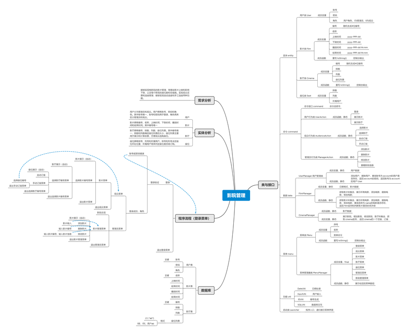

 

4. 主要代码设计

a.  java的设计思想

使用面向对象程序设计编程架构，目的是使计算机程序由单个能够起到子程序作用的单元或对象组合而成，从而实现软件工程的三个主要目标：重用性、灵活性和扩展性。OOP=对象+类+继承+多态+消息，其中核心概念是类和对象。我们设计本影院管理系统模式的目标是尽量做到易扩展、易维护、少改代码、不改代码。

 

b. 泛型集合的使用

普通集合可以存储任何数据类型的数据，这样写虽然方便（可以存储所有的基本数据类型），但是当取出时会发生数据类型强制转换（装箱与拆箱），当数据量很大时会严重影响效率。而泛型集合恰恰可以解决这一问题，通过指定数据类型，避免装箱与拆箱，大幅度提升系统效率。

 

private static HashMap<String, Cinema> cinemaData = new HashMap<>();

 

c. 分层设计

在软件体系架构设计中，分层式结构是最常见，也是最重要的一种结构。微软推荐的分层式结构一般分为三层，我们小组将整个系统按照三层架构模型划分为以下三个部分：

（1）表现层(U)——Launcher

用于实现展现给用户的界面，即用户在使用一个系统的时候他的所见所得，包括登陆界面、影片及基本信息介绍页面、管理员增删影片界面等。

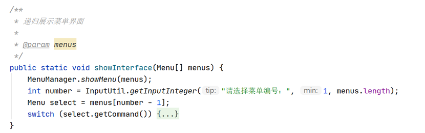

（2）业务逻辑层(BLL)——command

针对具体问题的操作，也可以说是对数据层的操作，对数据业务逻辑处理。其中包括登陆登出操作、选择影片、订座、菜单切换等等。

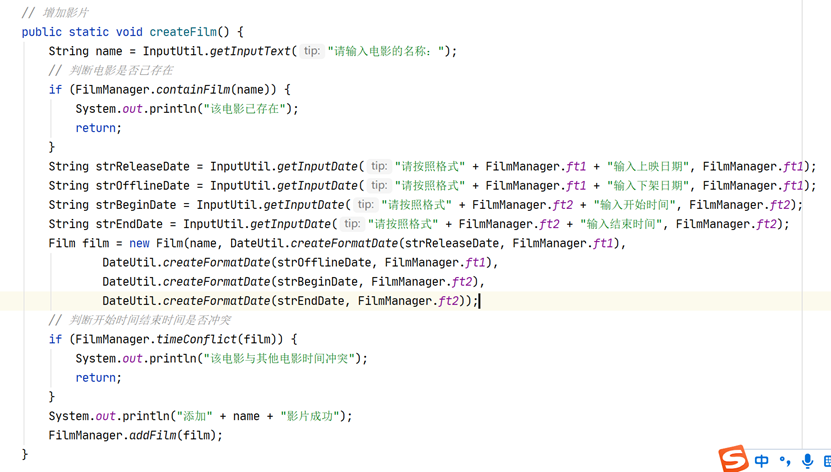

 

（3）数据访问层(DAL)——dao

该层所做事务直接操作数据库,针对数据的增添、删除、修改、查找等。

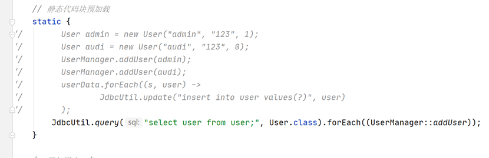

 

我们使用分层结构的是为了能够实现“高内聚，低耦合”，实现以下优势：

（1）结构清晰、耦合度低

（2）可维护性高，可扩展性高

（3）利于开发任务同步进行, 容易适应需求变化

 

 

# 5. 实现界面 

登录之后，根据返回的用户角色会进入观众菜单或管理员菜单。

之后便是递归循环在不同菜单之间，直至做出退出命令。

 

**1****、登录菜单**

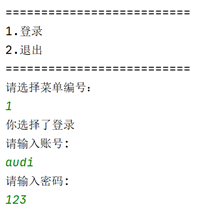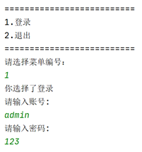

**2****、观众菜单**

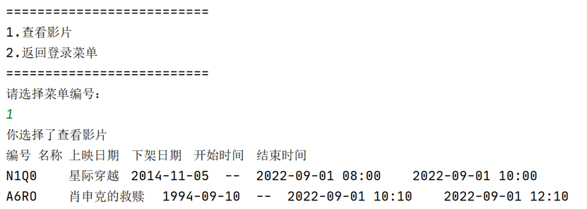

**3****、选择影片菜单**

**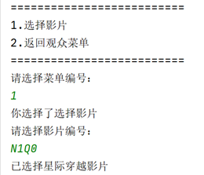**

**4****、选择影厅菜单**

**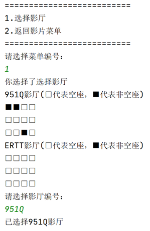**

**5****、订座菜单**

**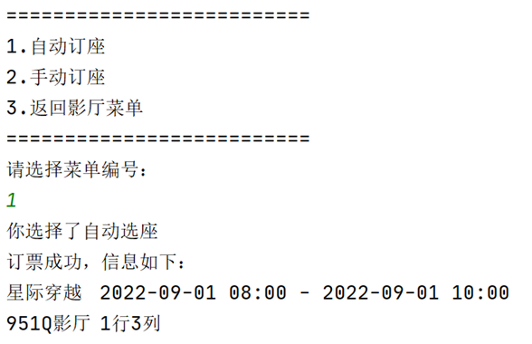**

**6****、管理员菜单**

**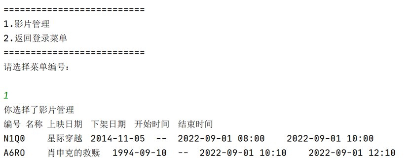**

**7****、影片管理菜单**

**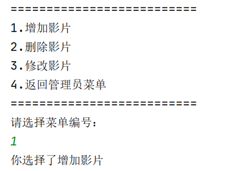**